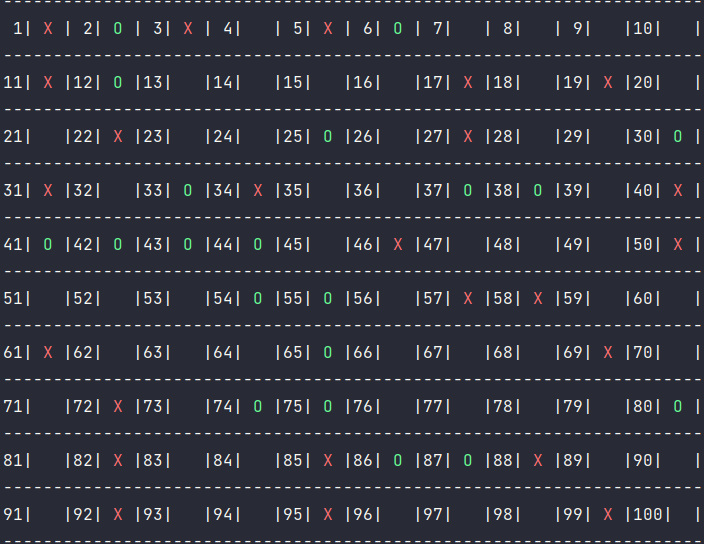

# Игра "Обратные крестики-нолики"

### 
Общая логика работы игры. Функция main

1) Выбираем - играть за O или X:
    - переменные h_choice и c_choice хранят выбор человека и компьютера

2) Выбираем - начать первым или вторым:
    - переменная first - хранит выбор человека: Y или N
3) Запускается основной цикл, в котором человек и компьютер 
ходят по-очереди, пока есть пустые клетки и игра не закончена
~~~~python
while len(empty_cells(board)) > 0 and not game_over(board):
    if first == 'N':
        ai_turn(c_choice, h_choice)
        first = ''
      
    human_turn(c_choice, h_choice)
    ai_turn(c_choice, h_choice)
...
~~~~
4) Если игра закончилась, то проходит проверка того, кто выиграл,
и выводится соответствующее сообщение
~~~~python
if wins(board, HUMAN, num, rule):
    clean()
    print(f'Human turn [{h_choice}]')
    render(board, c_choice, h_choice)
    print(f"{win_loose_color}YOU WIN!{end_color}")
...
~~~~

### 
Как ходит человек

Игра человека обеспечивается функцией
~~~~python
def human_turn(c_choice, h_choice):...
~~~~

Игрок выбирает из свободных клеток.

В цикле его просят ввести номер клетки
~~~~python
    while move < 1 or move > 100:
        try:
            move = int(input('Use numpad (1..100): '))
            coord = moves[move]
            can_move = set_move(coord[0], coord[1], HUMAN)
    ....
~~~~
Далее после проверок на валидность значение фиксируется на игровом поле.

### 
Как ходит компьютер

Игра компьютера задается функцией
~~~~python
def ai_turn(c_choice: str, h_choice: str):
   ...
~~~~

- Первые десять ходов компьютер делает в случайном порядке
~~~~python
if empty_cells_amount > 80:
    # выбираем случайную строку
    x = choice(list(range(num)))
    # выбираем случайный столбец
    y = choice(list(range(num)))
~~~~
- Далее идет обращение к рекурсивной функции основанной на
  алгоритме minimax. Глубина рекурсии начинается с 2 и возрастает по мере
  уменьшения количества свободных клеток. Это значит, что сложность игры
  постепенно увеличивается, так как решения компьютера становятся все более
  взвешенными.
  
~~~~python
elif empty_cells_amount > 40:
    depth = 2
    move = minimax(board, depth, COMP)
    x, y = move[0], move[1]
elif empty_cells_amount > 30:
    depth = 3
    move = minimax(board, depth, COMP)
    x, y = move[0], move[1]
...
~~~~

- Когда функция minimax возвращает координаты наиболее выгодного хода,
то он фиксируется на игровом поле
~~~~python
  set_move(x, y, COMP)
~~~~

### 
tictactoe.py

В файл tictactoe.py вынесены некоторые функции:

~~~~python
def choose_color(text: str): ...
~~~~~

Функция принимает строку и возвращает цвет в виде [ANSI escape code](https://en.wikipedia.org/wiki/ANSI_escape_code) в зависимости от принятого значения

Это необходимо, чтобы раскрасить X, O и другие элементы разными цветами при игре в консоли

### 
Источники информации

Google:
- [Print Colors in Python terminal](https://www.geeksforgeeks.org/print-colors-python-terminal/)
- [ПРИНЦИП МАКСИМИНА (МИНИМАКСА)](http://www.math.mrsu.ru/text/courses/method/princip_maxmin_minmax.htm)
- [Минимакс и максимакс](https://math.semestr.ru/games/minimax.php)

Wiki:
- [ANSI escape code](https://en.wikipedia.org/wiki/ANSI_escape_code)

Stack Overflow:
- [Get all the diagonals in a matrix/list of lists in Python](https://stackoverflow.com/questions/6313308/get-all-the-diagonals-in-a-matrix-list-of-lists-in-python)
- [What is wrong with my minimax algorithm for tictactoe](https://stackoverflow.com/questions/31617469/what-is-wrong-with-my-minimax-algorithm-for-tictactoe)

YouTube
- [Algorithms Explained – minimax and alpha-beta pruning](https://youtu.be/l-hh51ncgDI)
- [What is the Minimax Algorithm? - Artificial Intelligence](https://youtu.be/KU9Ch59-4vw)
