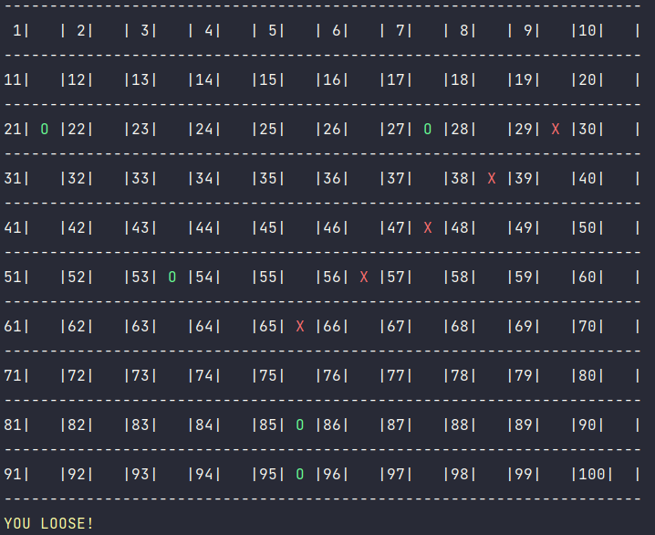

# "Обратные крестики-нолики"
Консольная игра на поле 10 x 10 с правилом «Пять в ряд» – проигрывает тот,
у кого получился вертикальный, горизонтальный или диагональный ряд из пяти своих фигур (крестиков/ноликов).

Игра запускается из файла main.py

~~~~shell
python main.py
~~~~
Несколько функций вынесены в файл tictactoe.py

В работе использовался python3.9 и библиотеки:
- numpy
- math
- random
- platform
- time
- os 

Игра работает в режиме «человек против компьютера».

 

 

### 
Общая логика работы игры. Функция main

1) Выбираем - играть за O или X:
    - переменные h_choice и c_choice хранят выбор человека и компьютера

2) Выбираем - начать первым или вторым:
    - переменная first - хранит выбор человека: Y или N
3) Запускается основной цикл, в котором человек и компьютер 
ходят по-очереди, пока есть пустые клетки и игра не закончена
~~~~python
while len(empty_cells(board)) > 0 and not game_over(board):
    if first == 'N':
        ai_turn(c_choice, h_choice)
        first = ''
      
    human_turn(c_choice, h_choice)
    ai_turn(c_choice, h_choice)
...
~~~~
4) Если игра закончилась, то проходит проверка того, кто выиграл,
и выводится соответствующее сообщение
~~~~python
if wins(board, HUMAN, num, rule):
    clean()
    print(f'Human turn [{h_choice}]')
    render(board, c_choice, h_choice)
    print(f"{win_loose_color}YOU WIN!{end_color}")
...
~~~~

### 
Как ходит человек

Игра человека обеспечивается функцией
~~~~python
def human_turn(c_choice, h_choice):...
~~~~

Игрок выбирает из свободных клеток.

В цикле его просят ввести номер клетки
~~~~python
    while move < 1 or move > 100:
        try:
            move = int(input('Use numpad (1..100): '))
            coord = moves[move]
            can_move = set_move(coord[0], coord[1], HUMAN)
    ....
~~~~
Далее после проверок на валидность значение фиксируется на игровом поле.

### 
Как ходит компьютер

Игра компьютера задается функцией
~~~~python
def ai_turn(c_choice: str, h_choice: str):
   ...
~~~~

- Первые десять ходов компьютер делает в случайном порядке
~~~~python
if empty_cells_amount > 80:
    # выбираем случайную строку
    x = choice(list(range(num)))
    # выбираем случайный столбец
    y = choice(list(range(num)))
~~~~
- Далее идет обращение к рекурсивной функции основанной на
  алгоритме minimax. Глубина рекурсии начинается с 2 и возрастает по мере
  уменьшения количества свободных клеток. Это значит, что сложность игры
  постепенно увеличивается, так как решения компьютера становятся все более
  взвешенными.
  
~~~~python
elif empty_cells_amount > 40:
    depth = 2
    move = minimax(board, depth, COMP)
    x, y = move[0], move[1]
elif empty_cells_amount > 30:
    depth = 3
    move = minimax(board, depth, COMP)
    x, y = move[0], move[1]
...
~~~~

- Когда функция minimax возвращает координаты наиболее выгодного хода,
то он фиксируется на игровом поле
~~~~python
  set_move(x, y, COMP)
~~~~

### 
Алгоритм Minimax

Реализация алгоритма выглядит следующим образом:
~~~~python
def minimax(state, depth, player):
    """
    Функция возвращает координаты самого выгодного хода для компьютера
    :param state: текущее состояние игрового поля
    :param depth: глубина рекурсии
    :param player: Человек или Компьютер HUMAN or COMP
    :return: возвращается лист с [координатой лучшей строки, координатой лучшей колонки, лучшим результатом]
    """
    # при выборе выгодного хода компьютер использует параметр score - лучший результат
    # при правильном ходе score увеличивается, при ошибочном уменьшается
    # изначально он равен -infinity. И компьютеру необходимо максимизировать это значение
    if player == COMP:
        best = [-1, -1, -infinity]
    # изначальный score человека равен +infinity.
    # и человек должен минимизировать это значение, совершая правильные ходы
    else:
        best = [-1, -1, +infinity]
        
    # если в рекурсии достигнуто дно, то возвращается лучший результат
    if depth == 0 or game_over(state):
        score = evaluate(state)
        return [-1, -1, score]

    # перебираем в рекурсии свободные клетки,
    # на каждой итерации чередуя и моделируя ход компьютера и человека
    for cell in empty_cells(state):
        x, y = cell[0], cell[1]
        state[x][y] = player
        score = minimax(state, depth - 1, -player)
        state[x][y] = 0
        score[0], score[1] = x, y

        # сохраняем текущий лучший результат для компьютера
        if player == COMP:
            if score[2] > best[2]:
                best = score  # max value
        # сохраняем текущий лучший результат для человека
        else:
            if score[2] < best[2]:
                best = score  # min value

    return best
~~~~
Так выглядит пример визуализации дерева рекурсии

    

 

### 
tictactoe.py

В файл tictactoe.py вынесены некоторые функции:

~~~~python
def choose_color(text: str): ...
~~~~~

Функция принимает строку и возвращает цвет в виде [ANSI escape code](https://en.wikipedia.org/wiki/ANSI_escape_code) в зависимости от принятого значения

Это необходимо, чтобы раскрасить X, O и другие элементы разными цветами при игре в консоли

~~~~python
class Bcolors:
    # HEADER = '\033[95m'
    # OKBLUE = '\033[94m'
    # OKCYAN = '\033[96m'
    OKGREEN = '\033[92m'
    WARNING = '\033[93m'
    FAIL = '\033[91m'
    ENDC = '\033[0m'
    # BOLD = '\033[1m'
    # UNDERLINE = '\033[4m'
    
# если принят символ O
if (text.lower()) == 'o':
    color = Bcolors.OKGREEN
# если принят символ X
elif (text.lower()) == 'x':
    color = Bcolors.FAIL
~~~~

Функция принимет строку/столбец игрового поля и правило(сколько в ряд)
~~~~python
def split_ls(ls: list, rule) -> list:
    return [ls[i:i + rule] for i in range(len(ls) - 4)]
~~~~
А возвращает все возможные "5 в ряд" в виде вложенного списка
Если кто-то из игроков заполняет одну из пятерок своими ходами, то он проигрывает

Функция
~~~~python
def wins(state, player, num: int, rule: int) -> bool:
~~~~
Принимает текущее состояние всего игрового поля,
обозначение человека или компьютера (-1 или 1),
размерность игрового поля, правило(сколько в ряд)

Далее из state - (текущего состояния всего игрового поля)
Формируется вложенный список с текущими состояниями всех
возможных "5 в ряд" (строки, столбцы, любые диагонали)

Пример для игрового поля 3 x 3
~~~~python
# win_state = [
#     горизонтальные ряды
#     [state[0][0], state[0][1], state[0][2]],
#     [state[1][0], state[1][1], state[1][2]],
#     [state[2][0], state[2][1], state[2][2]],
#     вертикальные ряды
#     [state[0][0], state[1][0], state[2][0]],
#     [state[0][1], state[1][1], state[2][1]],
#     [state[0][2], state[1][2], state[2][2]],
#     диагональные ряды (тут для примера только две
#     диагонали, но функция проверяет абсолютно все возможные диагонали
#     [state[0][0], state[1][1], state[2][2]],
#     [state[2][0], state[1][1], state[0][2]],
# ]
~~~~

Если в кокой-то из пятерок все значения будут (+1 для компьютера и -1 для человека)
, то этот игрок проигрывает

Функция возвращает True если игрок проиграл и False если не проиграл

~~~python
# этот список будет заполняться всеми горизонтальными пятерками
    horizontal = []
    # этот список будет заполняться всеми вертикальными пятерками
    vertical = []
    # перебираем все варианты
    for i in range(num):
        tmp1 = []
        tmp2 = []
        for j in range(num):
            tmp1.append(state[i][j])
            tmp2.append(state[j][i])
        # добавляем в список все возможные пять в ряд из текущей строки
        horizontal += split_ls(tmp1, rule)
        # добавляем в список все возможные пять в ряд из текущего столбца
        vertical += split_ls(tmp2, rule)

    # чтобы извлечь все диагонали нужно воспользоваться np.array
    test = np.array(state)
    tmp = []
    # получаем все диагонали
    diags = [test[::-1, :].diagonal(i) for i in range(-9, 10)]
    diags.extend(test.diagonal(i) for i in range(9, -10, -1))
    # перебираем полученные диагонали и оставляем только те, которые >= 5
    for i in diags:
        if len(i) >= 5:
            # из выбранной диагонали извлекаем все "5 в ряд"
            for j in (split_ls(i, rule)[0:]):
                tmp.append(list(j))

    # объединяем горизонтальные, вертикальные и диагональные "5 в ряд" в один список
    test2 = [*horizontal, *vertical, *tmp]

    # если любая пятерка будет полностью заполнена значениями одного из игроков (+1 или -1)
    # то этот игрок проигрывает
    if [player] * rule in test2:
        return True
    else:
        return False
~~~~

Функция
~~~~python
def valid_moves(num: int) -> dict:
    # функция для определения доступных ходов
    # принимает размерность игрового поля
    # возвращает словарь в котором ключ - номер клетки, а значение - координаты клетки
    # пример для  игрового поля 3 x 3:
    # moves = {
    #     1: [0, 0], 2: [0, 1], 3: [0, 2],
    #     4: [1, 0], 5: [1, 1], 6: [1, 2],
    #     7: [2, 0], 8: [2, 1], 9: [2, 2],
    # }
...
~~~~

### 
Источники информации

Google:
- [Print Colors in Python terminal](https://www.geeksforgeeks.org/print-colors-python-terminal/)
- [ПРИНЦИП МАКСИМИНА (МИНИМАКСА)](http://www.math.mrsu.ru/text/courses/method/princip_maxmin_minmax.htm)
- [Минимакс и максимакс](https://math.semestr.ru/games/minimax.php)

Wiki:
- [ANSI escape code](https://en.wikipedia.org/wiki/ANSI_escape_code)

Stack Overflow:
- [Get all the diagonals in a matrix/list of lists in Python](https://stackoverflow.com/questions/6313308/get-all-the-diagonals-in-a-matrix-list-of-lists-in-python)
- [What is wrong with my minimax algorithm for tictactoe](https://stackoverflow.com/questions/31617469/what-is-wrong-with-my-minimax-algorithm-for-tictactoe)

YouTube
- [Algorithms Explained – minimax and alpha-beta pruning](https://youtu.be/l-hh51ncgDI)
- [What is the Minimax Algorithm? - Artificial Intelligence](https://youtu.be/KU9Ch59-4vw)

GitHub
- [tic-tac-toe-minimax](https://github.com/Cledersonbc/tic-tac-toe-minimax)
- [Tic Tac Toe](https://gitlab.com/sunilghimire/tic-tac-toe)
- [Tic-Tac-Toe-Python](https://github.com/VaibhavSaini19/Tic-Tac-Toe-Python)

### 
Что можно улучшить?

- Сделать веб-приложение Django+JS. Напрммер, https://cledersonbc.github.io/tic-tac-toe-minimax/
- Сделать графический интерфейс Tkinter/Turtle. Например, https://github.com/VaibhavSaini19/Tic-Tac-Toe-Python
- Попробовать другие значения параметров рекурсии
- Оптимизировать громоздкие циклы
