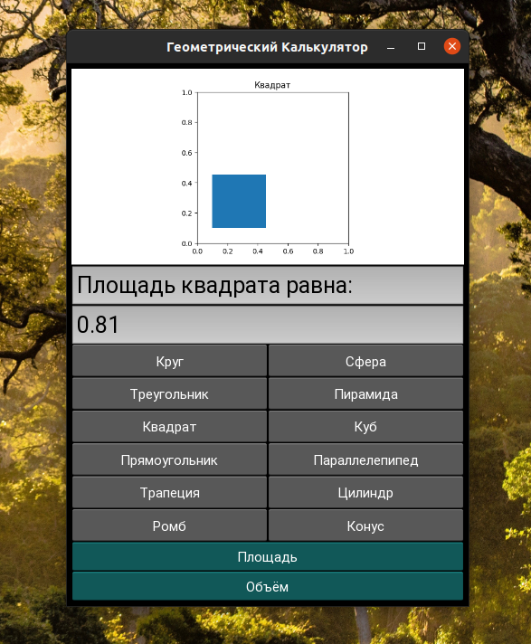
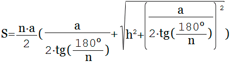
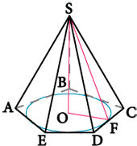
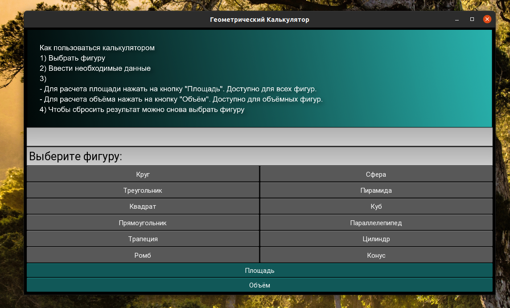
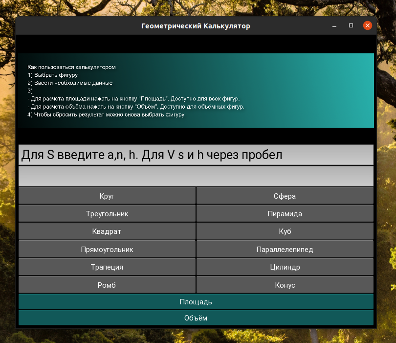
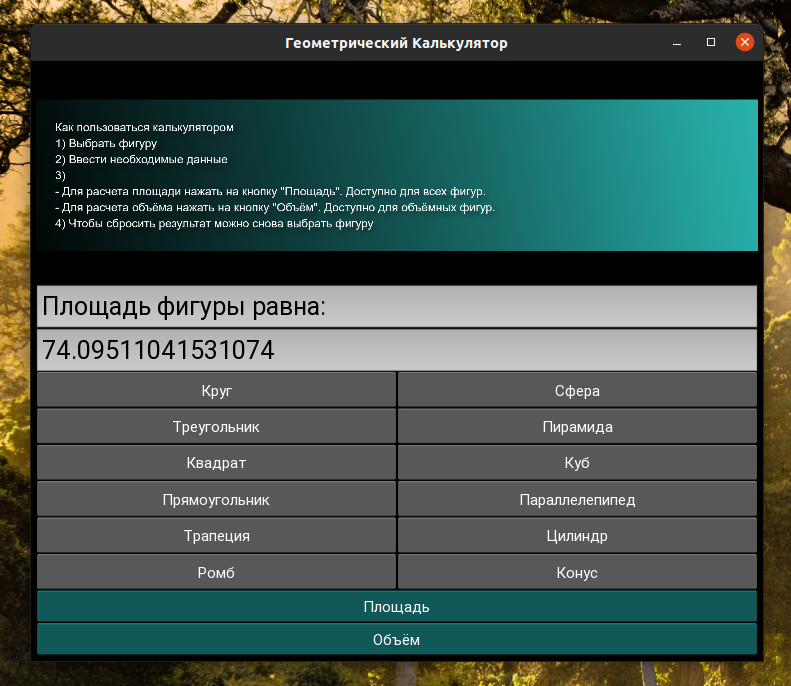
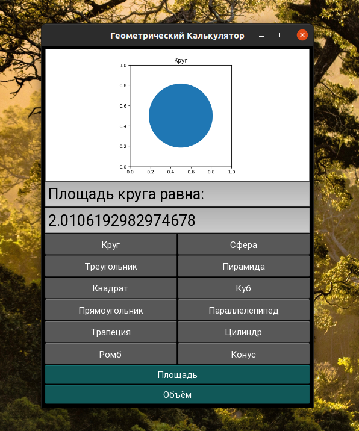

# Геометрический калькулятор
    
Калькулятор спроектирован и реализован при помощь ООП для вычисления площади и объема геометрических фигур.

Плоские фигуры: круг, квадрат, прямоугольник, треугольник, трапеция, ромб.

Объемные фигуры: сфера, куб, параллелепипед, пирамида, цилиндр, конус.

Калькулятор запускается из файла

```shell
calculator.py
```

Классы содержащие методы для расчета площади и объема вынесены в файл area_volume.py

Тесты программы находятся в файле test.py

В работе использовался python3.9 и библиотеки:

- kivy
- math
- numpy
- matplotlib
- unittest

Программа имеет графический интерфейс. Визуализация фигур пока доступна только для квадрата и круга.

<p align="center">

</p>

## Как работает калькулятор на примере вычисления площади пирамиды

Калькулятор считает площадь полной поверхности правильной пирамиды через высоту

<p>


</p>

При запуске калькулятора пользователя просят выбрать фигуру. А на экране появляется инструкция.



Интерефейс реализован с помощью фреймворка kivy

Основные части приложения kivy:
- BoxLayout - окно включающее в себя все остальные элементы
~~~~python
# создание главного окна
    root = BoxLayout(orientation="vertical", padding=5)
~~~~~


- Image - показывает изображения

~~~python

# создание окна для показа изображения
self.image = Image(source="instruction.png")
~~~

- TextInput - поле ввода и отображения текста

~~~~python 
# цвет фона указывается в rgba
        self.box1 = TextInput(
                text="", readonly=True, font_size=25,
                size_hint=[1, .20], background_color=[1, 1, 1, .8])
~~~~

- GridLayout - включает в себя все кнопки


~~~python
figure_buttons = GridLayout(cols=2)

# в цикле добавляем в приложение все кнопки фигур
figures_ls = [
            "Круг", "Сфера", "Треугольник", "Пирамида", "Квадрат",
            "Куб", "Прямоугольник", "Параллелепипед", "Трапеция",
            "Цилиндр", "Ромб", "Конус"]

for i in figures_ls:
    figure_buttons.add_widget(
        Button(text=f"{i}", on_press=self.calculate))
~~~



Пользователь выбирает пирамиду и ему предлагается ввести данные в нжиний текстбокс

Для расчета площади необходимо ввести с клавиатуры:

- a - длину стороны основания
- n - количество сторон основания
- h - высота пирамиды

Пользователь вводит данные и нажимает на кнопку площадь

Для взаимодействия с пользователем служит метод calculate, который обрабатывает всю информацию от пользователя:
- нажатия кнопок
- данные, введенные в текстовое поле

~~~python
# метод, взаимодействеющий с пользователем
def calculate(self, button) -> None:
    """
    :param button: нажатая кнопка
    """
~~~

При обращении к этому методу создается объект класса геометрические фигуры

~~~python
figure = GeometricFigures()
~~~

Далее создается глобальная переменная name, которая будет хранить имя выбранной фигуры до следующего выбора фигуры

~~~ python
global name
# при выборе фигуры выводится предложение ввести необходимые данные
if button.text in welcome_message:
    # сохраняется имя выбранной фигуры
    name = button.text
    self.box1.text = welcome_message[name]
    # нижний текстбокс освобождается, чтобы пользователь ввел данные
    self.box2.text = ""
~~~

Перед нажатием кнопки "Площадь" пользователь ввел данные для пирамиды
Эти данные обрабатываются методом area класса GeometricFigures

Также этот метод прнимает название выбранной фигуры, чтобы именно для нее посчитать и вернуть площадь 
~~~python
self.box2.text = str(
figure.area(data, figure_name=f"{name}"))
# изображение, которое показывается после подсчета
self.image.source = 'instruction.png'
# сообщение будет показано вместе с результатом
self.box1.text = "Площадь фигуры равна:"
~~~

~~~python
class GeometricFigures:
    figure_area = 0

    def area(self, data: str, figure_name="") -> float:
        """
        :param data: аргументы для вычисления площади определенной фигуры
        :param figure_name: имя фигуры для которой нужно посчитать площадь
        :return: возвращается посчитанная площадь
        """
~~~

По названию фигуры, которое хранится в глобальной переменной name в методе подбирется необходимая формула.

В нашем случае это пирамида
~~~python
elif figure_name == "Пирамида":
    # a - длина стороны n - количество сторон  h - высота пирамиды
    anh = data.split()
    # данные от пользователя приходят строкой,
    # поэтому они преобразуются для дальнейших вычислений
    a, n, h = float(anh[0]), float(anh[1]), float(anh[2])
    # считается площадь
    s = ((n * a)/2) * ((a/(2*tan(radians(180)/n))) +
                       (h**2 + (a/(2*tan(radians(180)/n)))**2)**0.5)
    self.figure_area += s
~~~

Результат возвращется пользователю

<p align="center">
 
</p>

## <p align = "center">Визуализация фигур</p>

Визуализация пока доступна только для круга и квадрата.

Использовалась библиотека matplotlib

<p align="center">

</p>

Когда пользователь считает плоащадь для круга или квадрата, то также вызывается метод plot класса GeometricFigures

~~~~python
if name == "Круг" or name == "Квадрат":
    self.box2.text =\
        str(figure.area(data, figure_name=f"{name}"))
    # также данные направляются в метод plot
    # чтобы показать визуализацию
    # но только если фигура - квадрат или круг
    figure.plot(data, figure_name=f"{name}")
    # выводим визуализацию
    self.image.source = 'plot.png'
    # перезагружаем изображение,
    # на случай если оно изменилось
    self.image.reload()
    # выводим результат расчета
    self.box1.text =\
        f"Площадь {name.lower()}а равна:"
~~~~

Метод принимает:
- имя фигуры
- введенные пользователем данные для расчета площади
~~~~python
def plot(self, data: str, figure_name=""):
    """
    Метод предназначен для визуализации фигур
    :param data: данные, которые пользователь ввел для расчета площади
    :param figure_name: имя фигуры, для которой производится расчет
    :return: метод ничего не возвращает. Он сохраняет plot в файл
    """
    cm = 1/2.54

    # задаем плоскость для визуализации
    # по умолчанию matplotlib использует inch,
    # но можно использовать сантиметры, если пользоваться переводом
    figure, axes = plt.subplots(figsize=(20*cm, 10*cm))
    axes.set_aspect(1)

    # если фигура круг
    if figure_name == "Круг":
        # строим круг с ориентацией по x,y 0.5
        circle = plt.Circle((0.5, 0.5), float(data)*cm)
        axes.add_patch(circle)

    # если фигура квадрат, то он строится с началом по x, y 0.1
    elif figure_name == "Квадрат":
        square =\
            plt.Rectangle((0.1, 0.1), float(data)*cm, float(data)*cm)
        axes.add_patch(square)

    # добавляем название фигуры на график
    plt.title(f"{figure_name}")
    # сохраняем график в файл
    # это файл будет загружаться калькулятором и отображаться
    figure.savefig('plot.png')
 ~~~~


## Источники информации
Документация:
- [Welcome to Kivy](https://kivy.org/doc/stable/)
- [Button](https://kivy.org/doc/stable/api-kivy.uix.button.html#kivy.uix.button.Button.background_normal)
- [Figure size in different units](https://matplotlib.org/devdocs/gallery/subplots_axes_and_figures/figure_size_units.html)

Книги:
- Мэтт Харрисон: Как устроен Python.

Stack Overflow
- [How do I run multiple Python test cases in a loop?](https://stackoverflow.com/questions/19071601/how-do-i-run-multiple-python-test-cases-in-a-loop)
- [plot a circle with pyplot](https://stackoverflow.com/questions/9215658/plot-a-circle-with-pyplot)
- [Changing the background color of a Button in Kivy](https://stackoverflow.com/questions/20181250/changing-the-background-color-of-a-button-in-kivy)
- [Save plot to image file instead of displaying it using Matplotlib](https://stackoverflow.com/questions/9622163/save-plot-to-image-file-instead-of-displaying-it-using-matplotlib)
- [Avoiding "Too broad exception clause" warning in PyCharm](https://stackoverflow.com/questions/40775709/avoiding-too-broad-exception-clause-warning-in-pycharm)

GitHub
- [learning_python](https://github.com/DrPierreChang/linkedIn_learning/tree/main/become_a_python_developer/learning_python/exercise_files/Ch2)

Хабр:
- [Юнит-тесты на Python: Быстрый старт](https://habr.com/ru/company/otus/blog/481806/)
- [Что такое *args и **kwargs в Python?](https://habr.com/ru/company/ruvds/blog/482464/)

Wiki:
- [RGBA color model](https://en.wikipedia.org/wiki/RGBA_color_model)

YouTube:
- [Python Kivy Калькулятор](https://youtu.be/Mu4mps4imJ4)

Другие:
- [Trigonometric Functions in Python - sin, cos, tan etc](https://www.studytonight.com/post/trigonometric-function-in-python)
- [6 Ways to Plot a Circle in Matplotlib](https://www.pythonpool.com/matplotlib-circle/)
- [Площадь пирамиды](https://allcalc.ru/node/205)
- [Модуль unittest: тестируем свои программы](https://pythonworld.ru/moduli/modul-unittest.html)
- [How to use unittest to test multiple cases with assertEqual in python?](https://www.reddit.com/r/Python/comments/5od10q/how_to_use_unittest_to_test_multiple_cases_with/)
- [Matplotlib нарисовать треугольник с заданными сторонами от ввода](https://stackru.com/questions/1544673/matplotlib-narisovat-treugolnik-s-zadannyimi-storonami-ot-vvoda)
- [How to Draw Rectangles in Matplotlib](https://www.statology.org/matplotlib-rectangle/)
- [Plot a Circle in Matplotlib](https://www.delftstack.com/howto/matplotlib/how-to-plot-a-circle-in-matplotlib/)
- [Бирюзовые цвета и оттенки](https://get-color.ru/turquoise/)
- [КОНВЕРТЕР ЦВЕТОВ](https://colorscheme.ru/color-converter.html)
- [Метод str.rsplit() и split() в Python](https://pythonstart.ru/string/metod-str-split-python)
- [Исключения в python](https://pythonworld.ru/tipy-dannyx-v-python/isklyucheniya-v-python-konstrukciya-try-except-dlya-obrabotki-isklyuchenij.html)
- [Метод isdigit() в Python](https://pythonstart.ru/string/isdigit-python)
- [Стандартный синтаксис разметки reStructuredText](https://sphinx-ru.readthedocs.io/ru/latest/rst-markup.html)

### <p align="center">Что можно улучшить?</p>
- Добавить визуализацию остальных фигур
- Расширить функциональность
- Попробовать другие конфигурации и сочетания элементов kivy
